# Danny-s-Diner: Business-analysis

### _Insights and Recommendations to Help Danny's Diner Thrive._

## Introduction

Danny, a passionate Japanese food lover, decided to embark on a risky venture in early 2021 by opening a charming little restaurant serving his three favorite dishes: sushi, curry, and ramen. However, after a few months of operation, Danny's Diner is struggling to stay afloat. Danny has then collected some basic data, but he doesn't know how to use it to improve his business. More so, he would like to improve his customer loyalty because more loyal customers mean free marketing, more revenue as they visit regularly, and genuine customer feedback to help him improve the restaurant's offerings. Hence, I am playing the role of a data analyst at Danny's Diner to help him make data-driven decisions and improve his business.

_P.S_:This is challenge 1 — [Danny’s Diner](https://8weeksqlchallenge.com/case-study-1/) of the [8 Weeks SQL Challenge](https://8weeksqlchallenge.com/getting-started/) by Danny Ma. 

## Problem statement

Danny believes that having a deeper understanding of his customers will help him provide a better and more personalized experience for his loyal customers. He also plans to use these insights to help him decide whether to expand his existing customer loyalty program. Danny therefore wants to use his customer data to answer the following business questions:

1. What is the total amount each customer spent at the restaurant? The amount spent by each customer would help Danny know just how much each customer generates for his restaurant and, therefore, how to drive more sales.
2. How many days has each customer visited the restaurant? Danny is interested in finding out how often his customers visit or revisit his restaurant because this value directly impacts revenue generated as well as shedding light on customer loyalty.
3. What was the first item from the menu purchased by each customer? By analyzing customer data, Danny can gain insights into what items new customers are likely to purchase on their first visit to the restaurant.
4. What is the most purchased item on the menu, and how many times has it been purchased by all customers? Knowing the most popular item on the menu, Danny can equip his restaurant to ensure that it is always available to serve his growing customer base.
5. Which item was the most popular for each customer? Danny can create a personalized experience for each customer by knowing their favorite order.
6. Which item was purchased first by the customer after they became a member? Danny is curious to see if membership affects customers' orders.
7. Which item was purchased just before the customer became a member?
8. What is the total items and amount spent for each member before they became a member? He wants to know how many items were purchased and the total amount spent before his customers signed up for membership in his restaurant.
9. If each $1 spent equates to 10 points and sushi has a 2x points multiplier - how many points would each customer have? These insights would help Danny make data-backed decisions about expanding his customer loyalty program.
10. In the first week after a customer joins the program (including their join date) they earn 2x points on all items, not just sushi - how many points do customer A and B have at the end of January?

Furthermore, Danny needs help generating some basic datasets from his customer data so that his team can easily inspect the data without needing to use SQL. The summary datasets required include:
- Joined tables from the analysis
- Ranking of customer products for member purchases

## About the Dataset

Danny provided me with a sample of his overall customer data due to privacy issues. The 3 key datasets provided for this analysis are:
- sales
- menu
- members

The Relationship diagram(known as Entity Relationship Diagram - ERD) for these datasets is shown below

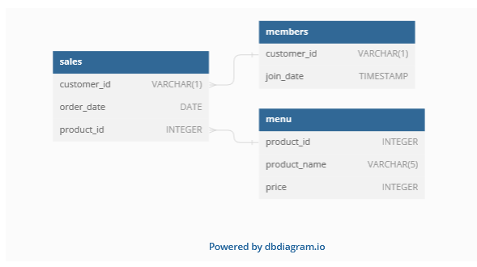

## Skills demonstrated

The following skills/concepts were demonstrated in the course of this project:
- Exploratory Data Analysis
- SQL table Joins
- Aggregate functions
- Common Table Expressions
- Subqueries
- Window Functions for ranking

## Data Analysis

I used MySQL Workbench to create a [database](SQL_files/Database_creation.sql) for Danny's Diner and for the entire analysis.

### Exploratory data analysis (EDA)
I carried out an EDA on the datasets provided to understand the basic characteristics of data which is essential for developing accurate and meaningful insights from the data. The code for the exploratory data analysis can be found [here](SQL_files/EDA.sql). 

Sales                             |Menu                       |Members
----------------------------------|---------------------------|-------------
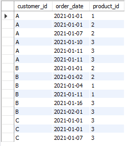  |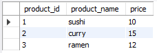    |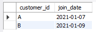

### Solutions to Business questions

Solutions to the business questions were written in [SQL codes](SQL_files/Data_analysis.sql) in MySQL relational database

1. What is the total amount each customer spent at the restaurant?

Customer A spent the most money, $76. Customer B spent $74, and Customer C spent $36. This information shows Danny how much revenue each customer brings in. He also learned that Customer C brings in the least revenue, which he sees as a major opportunity to increase sales.

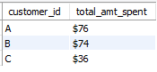

2. How many days has each customer visited the restaurant?

Customer B visited the restaurant six times, Customer A four times, and Customer C twice. This answers Danny's question of how often his customers come or revisit. He now knows that Customer B is a frequent customer, and he needs to take steps to ensure their satisfaction and encourage Customer A to revisit more often. He also needs to make sure that Customer C doesn't stop visiting the restaurant.

 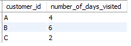

3. What was the first item from the menu purchased by each customer?

The analysis shows that each customer made a unique order on their first visit to the restaurant. Customer A ordered sushi, Customer B ordered curry, and Customer C ordered ramen. This suggests that each item on the menu is equally likely to be purchased by new customers.

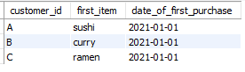

4. What is the most purchased item on the menu and how many times was it purchased by all customers?

Ramen is the most popular item on the menu, with eight orders from all customers. Curry is next with four orders, followed by sushi with three orders. Danny now knows that he needs to stock up on ingredients for ramen and manage his time and resources effectively to ensure that he can always meet customer demand.

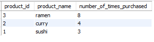

5. Which item was the most popular for each customer?

I joined the sales data to the menu data and used window and aggregate functions to rank the count of orders made and the number of times each order was made. This allowed me to determine the most popular item for each customer based on the number of times they purchased each item on the menu (check out the code [here](SQL_files/Data_analysis.sql)). For customer A, the most popular item was ramen. For customer B, all items (sushi, curry, and ramen) were equally popular. Customer C purchased ramen more than any other item.

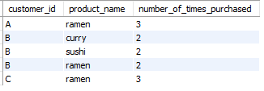

6. Which item was purchased first by the customer after they became a member?

Customers become members by registering and signing up. After becoming a member, Customer A ordered ramen, and Customer B ordered sushi. Customer C has not yet become a member. Analysis shows that customers' preferences do not change significantly after they become members.

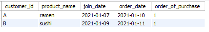

7. Which item was purchased just before the customer became a member?

I filtered the data to include only orders where the join date is greater than the order date. This shows that just before customer A became a member, he purchased sushi and curry. Customer B purchased sushi.

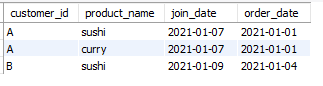

8. What is the total items and amount spent for each member before they became a member?

Customer A spent $25 on two items: sushi and curry. Customer B spent $40 on three items: curry, sushi, and curry.

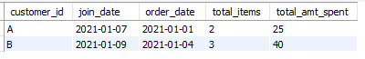

9. If each $1 spent equates to 10 points and sushi has a 2x points multiplier - how many points would each customer have?

Danny set a cutoff of 1,500 points to decide whether to expand his customer loyalty program. Based on the analysis, Customer B has the most points with 940, followed by Customer A with 860, and Customer C with 360. This data-backed decision shows that Danny should not expand his customer loyalty program until the majority of customers cross the 1,500-point cutoff, which will curtail expenses and increase revenue.

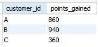

10. In the first week after a customer joins the program (including their join date) they earn 2x points on all items, not just sushi - how many points do customer A and B have at the end of January?
    
Customer A had 1,370 points by the end of January, while Customer B had 940. Danny should make an extra effort to keep Customer A engaged, as they are close to reaching the cutoff mark. He should also ensure that Customer B continues to visit.

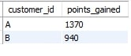

### Joined tables from the analysis

With the summary table below, Danny and his team can quickly derive insights without needing to join the underlying tables using SQL. An 'N' against any record shows that as of that date, the customer was not a member. 'Y' shows that the customer was a member as of that date.

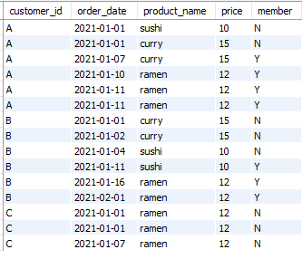

### Ranking of customer products for member purchases

Danny also required further information about the ranking of customer products, but he purposely does not need the ranking for non-member purchases. The null values are for records when customers are not yet part of the loyalty program.

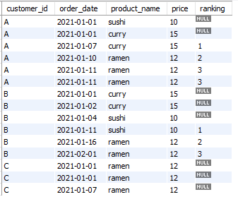

## Conclusion, Limitations and Recommendations

Danny wants to decide whether to expand his existing customer loyalty program or not, create a personalized experience for his customers, and know how to keep his business afloat. From the insights generated, I recommend the following:

**_Customer loyalty_**:

- Danny's Diner should offer a discount on membership to new members who sign up through social media.
- Create a tiered loyalty program that rewards customers for their repeat business. With the point allocation system already in place, customers could earn points for every dollar they spend, and redeem those points for discounts or free items.
- Offer exclusive perks and benefits to members, such as early access to new menu items, special discounts on certain days of the week, or free delivery.
- Personalize the customer experience by sending members birthday discounts, personalized menu recommendations, and other special offers.

**_Staying afloat_**:

- Track customer spending habits to identify popular and unpopular menu items.
- Adjust the menu accordingly, and offer discounts on unpopular items to boost sales.
- Procure data and analyze customer feedback to identify areas where improvement is needed. For example, if customers are complaining about slow service, Danny could hire more staff or invest in a new point-of-sale system.
- Control costs by carefully managing inventory and negotiating with suppliers.

**_Creating a personalized experience_**:

- Greet customers by name when they arrive at the restaurant.
- Remember customers' favorite orders and preferences (as highlighted from the insights)
- Offer personalized recommendations based on customers' past orders.
- Go the extra mile to make customers feel special, such as offering them a free dessert on their birthday or sending them a handwritten thank-you note after they leave a positive review.

One major limitation of this analysis is that it is based on a small sample of data from Danny's Diner. This means that the results of the analysis may not be accurate or representative of the entire customer base, including new customers. To get more accurate and reliable results, we would need to collect more data from a larger sample of customers.

By implementing the recommendations above, Danny can boost sales and profits, reduce the cost of customer acquisition, and ensure the longevity of his business.

