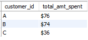
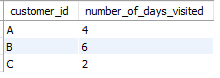

# Danny-s-Diner: Business-analysis

## Introduction

Danny, a passionate Japanese food lover, decided to embark on a risky venture in early 2021 by opening a charming little restaurant serving his three favorite dishes: sushi, curry, and ramen. However, after a few months of operation, Danny's Diner is struggling to stay afloat. Danny has then collected some basic data, but he doesn't know how to use it to improve his business. Hence I am playing the role of a data analyst at Danny’s Diner to help him make data driven decisions and improve his business.

_Disclaimer_:This is challenge 1 — [Danny’s Diner](https://8weeksqlchallenge.com/case-study-1/) of the [8 Weeks SQL Challenge](https://8weeksqlchallenge.com/getting-started/) by Danny Ma. 

## Problem statement

Danny believes that having a deeper understanding of his customers will help him provide a better and more personalized experience for his loyal customers. He also plans to use these insights to help him decide whether to expand his existing customer loyalty program. Danny therefore wants to use his customer data to answer the following business questions:

1. What is the total amount each customer spent at the restaurant?
2. How many days has each customer visited the restaurant?
3. What was the first item from the menu purchased by each customer?
4. What is the most purchased item on the menu and how many times was it purchased by all customers?
5. Which item was the most popular for each customer?
6. Which item was purchased first by the customer after they became a member?
7. Which item was purchased just before the customer became a member?
8. What is the total items and amount spent for each member before they became a member?
9. If each $1 spent equates to 10 points and sushi has a 2x points multiplier - how many points would each customer have?
10. In the first week after a customer joins the program (including their join date) they earn 2x points on all items, not just sushi - how many points do customer A and B have at the end of January?

Furthermore, Danny needs help generating some basic datasets from his customer data so that his team can easily inspect the data without needing to use SQL. The summary datasets required include:
- Joined tables from the analysis
- Ranking of customer products for member purchases

## About the Dataset

Danny provided me with a sample of his overall customer data due to privacy issues. The 3 key datasets provided for this analysis are:
- sales
- menu
- members

The Relationship diagram(known as Entity Realtionship Diagram - ERD) for these datasets is shown below

## Skills demonstrated

The following skills/concepts were demonstrated in the course of this project:
- Exploratory Data Analysis
- SQL table Joins
- Aggregate functions
- Common Table Expressions
- Subqueries
- Window Functions for ranking

## Data Analysis

I used MySQL Workbench to create a [database](Database_creation.sql) for Danny's Diner and for the entire analysis.

### Exploratory data analysis
The code for the exploratory data analysis can be found [here](EDA.sql). 

Sales                             |Menu                       |Members
----------------------------------|---------------------------|-------------
  |   |

### Solutions to Business questions

Solutions to the business questions were written in [SQL codes](Data_analysis.sql) in MySQL relational database

1. What is the total amount each customer spent at the restaurant?

2. How many days has each customer visited the restaurant?

3. What was the first item from the menu purchased by each customer?

4. What is the most purchased item on the menu and how many times was it purchased by all customers?

5. Which item was the most popular for each customer?

6. Which item was purchased first by the customer after they became a member?

7. Which item was purchased just before the customer became a member?

8. What is the total items and amount spent for each member before they became a member?

9. If each $1 spent equates to 10 points and sushi has a 2x points multiplier - how many points would each customer have?

10. In the first week after a customer joins the program (including their join date) they earn 2x points on all items, not just sushi - how many points do customer A and B have at the end of January?

